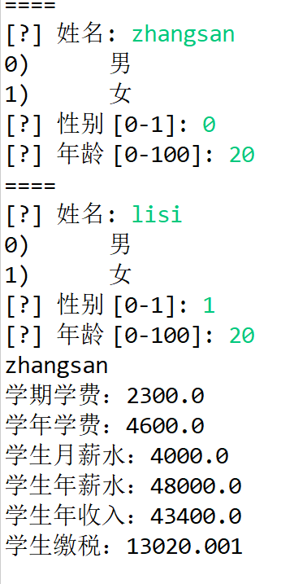
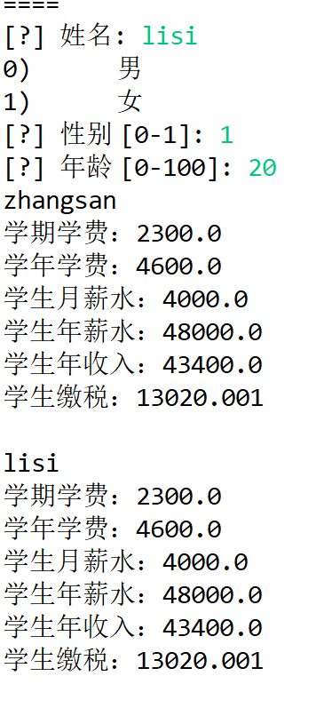

# 实验三、接口程序实验 计G202王飞2020322115

## 一、实验目的
掌握Java中抽象类和抽象方法的定义； 
掌握Java中接口的定义，熟练掌握接口的定义形式以及接口的实现方法
了解异常的使用方法，并在程序中根据输入情况做异常处理

## 二、实验内容
某学校为了给学生提供勤工俭学机会，也减轻授课教师的部分压力，准许博士研究生参与课程的助教工作。此时，该博士研究生有双重身份：学生和助教教师。
1.	设计两个管理接口：学生管理接口和教师管理接口。学生接口必须包括缴纳学费、查学费的方法；教师接口包括发放薪水和查询薪水的方法。
2.	设计博士研究生类，实现上述的两个接口，该博士研究生应具有姓名、性别、年龄、每学期学费、每月薪水等属性。（其他属性及方法，可自行发挥）
3.	编写测试类，并实例化至少两名博士研究生，统计他们的年收入和学费。根据两者之差，算出每名博士研究生的年应纳税金额（国家最新工资纳税标准，请自行检索）。

## 三、实验要求
1.	在 博士研究生类中实现各个接口定义的抽象方法;
2.	对年学费和年收入进行统计，用收入减去学费，求得纳税额；
3.	国家最新纳税标准（系数），属于某一时期的特定固定值，与实例化对象没有关系，考虑如何用static  final修饰定义。
4.	实例化研究生类时，可采用运行时通过main方法的参数args一次性赋值，也可采用Scanner类实现运行时交互式输入。
5.	根据输入情况，要在程序中做异常处理。

## 四、关键代码
```Java
学生接口
public interface Xuesheng {
    void purchaseTuition();
    float askTuition();
}
老师接口
public interface Laoshi {
    void getSalary();
    float askSalary();
}
错误处理
            try {
                finput = sc.nextFloat();
            } catch (InputMismatchException e) {
                System.out.println("错误");
            } catch (Exception ignored) {
            }

```

## 五、实验结果



## 六、实验感想

对抽象类和抽象方法的定义以及接口表达有了一定的了解，但实现方法还有些不解。
